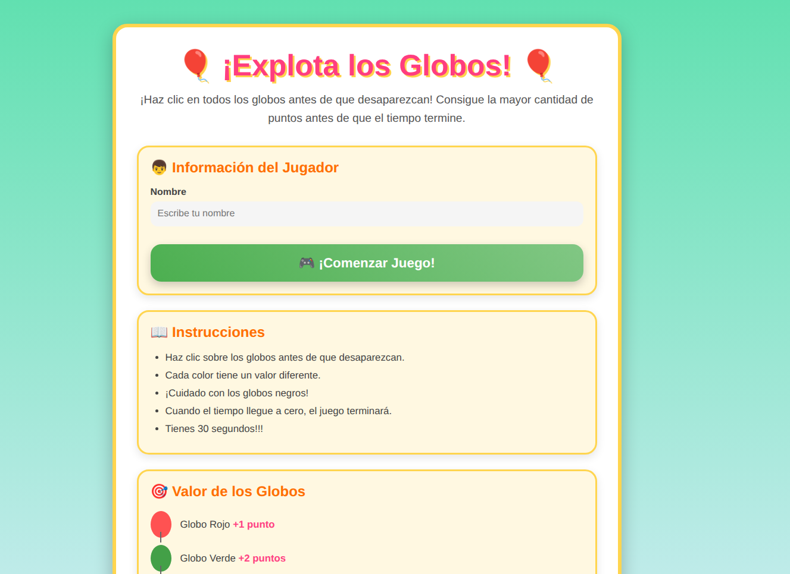
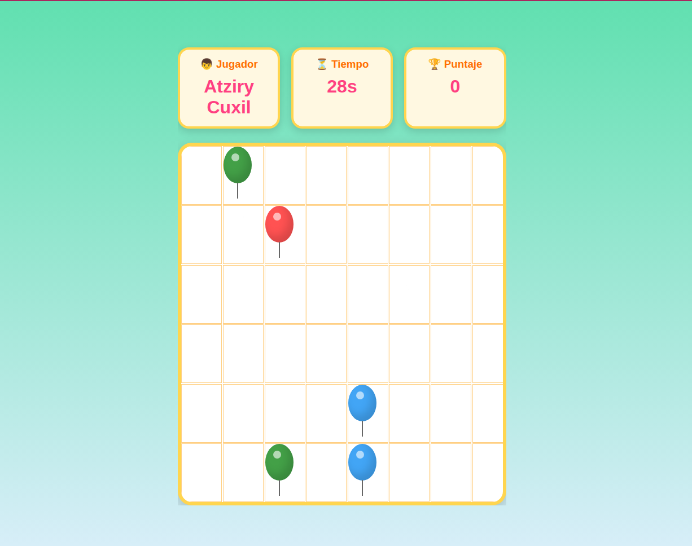
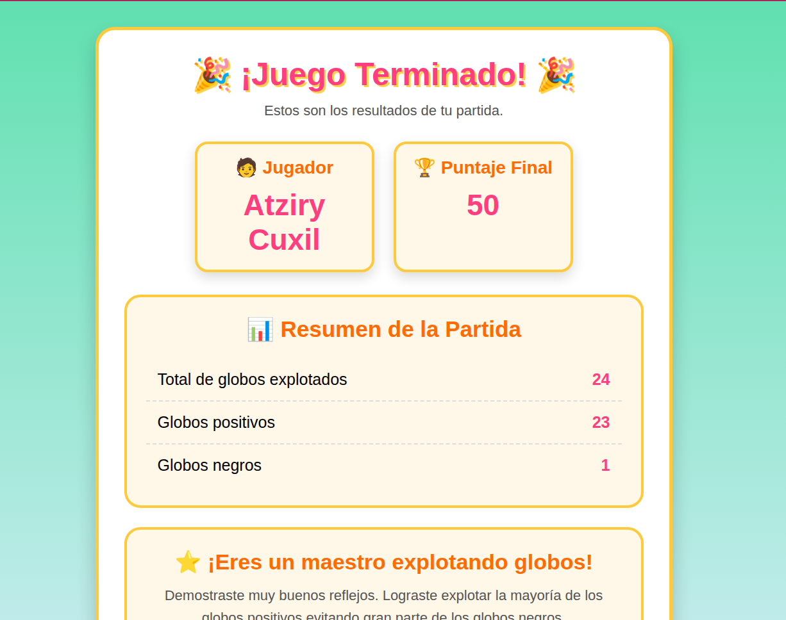

# 🎈 Explota los Globos

## Estudiante

**Nombre:** Atziry Cuxil

---

## Descripción del juego

**Explota los Globos** es un juego desarrollado con **React**, donde el objetivo es obtener la mayor cantidad de puntos posible durante una partida de **30 segundos**.

Los globos aparecen de manera aleatoria en la pantalla y el jugador debe hacer clic sobre ellos antes de que desaparezcan. Cada color de globo tiene una puntuación diferente y el globo negro resta puntos, por lo que el jugador debe decidir rápidamente cuáles explotar.

Al finalizar el tiempo, el juego muestra el puntaje obtenido y las estadísticas de la partida.

### Reglas del juego

- Haz clic sobre los globos antes de que desaparezcan.
- Cada color tiene un valor diferente.
- ¡Cuidado con los globos negros!
- El juego dura **30 segundos**.
- Cuando el tiempo llega a cero, la partida termina.

### Puntuación

| Globo | Puntos |
|--------|:------:|
| 🔴 Rojo | +1 |
| 🟢 Verde | +2 |
| 🔵 Azul | +5 |
| ⚫ Negro | -3 |

---

## Tecnologías utilizadas

- React 19
- Vite
- JavaScript (ES6)
- Context API
- CSS

---

## Instrucciones para ejecutar el proyecto

### 1. Clonar el repositorio

```bash
git clone git@github.com:atziry-cuxil/Juego--ExplotaLosGlobos.git
```

### 2. Entrar a la carpeta del proyecto

```bash
cd Juego--explotaLosGlobos
```

### 3. Instalar dependencias

```bash
npm install
```

### 4. Ejecutar el proyecto

```bash
npm run dev
```

### 5. Abrir el navegador

Ingresar a la dirección que muestra Vite, normalmente:

```
http://localhost:5173
```

---

## Conceptos de React utilizados

Durante el desarrollo del proyecto se utilizaron los siguientes conceptos de React:

- Componentes.
- JSX.
- `useState`.
- `useContext`.
- Context API.
- Manejo de eventos (`onClick`, `onSubmit`, `onChange`).
- Renderizado condicional entre las pantallas del juego.

---

## Uso de Context API

Se utilizó **Context API** para compartir el estado global del juego entre todos los componentes sin necesidad de enviar propiedades (props) manualmente.

Dentro del contexto se almacenan datos importantes como:

- Nombre del jugador.
- Puntaje.
- Tiempo restante.
- Estado de la pantalla de inicio.
- Estado de la pantalla final.
- Lista de globos.
- Cantidad de globos positivos y negativos explotados.

Además, desde el contexto se controlan las funciones principales del juego, como:

- Actualizar el puntaje.
- Reiniciar la partida.
- Actualizar el temporizador.
- Mostrar y ocultar pantallas.
- Generar los globos aleatoriamente.

Gracias a Context API fue posible mantener la información sincronizada entre todos los componentes de la aplicación.

---

## Dificultad principal encontrada

La mayor dificultad fue lograr que los globos aparecieran de forma aleatoria durante toda la partida.

---

## ¿Cómo se resolvió?

La solución consistió en seleccionar aleatoriamente diferentes índices del arreglo que contiene todos los globos. Posteriormente se cambió el estado (`estado`) de esos elementos para mostrarlos en pantalla.

Para mantener la dinámica del juego se utilizó un `setInterval`, que cada 4 segundos selecciona nuevos índices y actualiza los globos visibles. Además, se implementó un `setTimeout` para agregar y quitar algunos globos un segundo después, haciendo que la aparición fuera más dinámica y menos predecible.

---

## Estructura general del proyecto

```
src/
│
├── Contexto/
├── PantallaInicio/
├── PantallaDelJuego/
│   ├── ContenedorGlobos/
│   ├── Globo/
│   ├── Puntaje/
│   ├── TemporizadorDelJuego/
│   └── NombreDelJugador/
│
├── PantallaFinal/
│   ├── EstadisticasGlobos/
│   ├── MensajeAlUsuario/
│   ├── PuntajeFinal/
│   ├── NombreJugador/
│   └── BotonReiniciar/
│
├── App.jsx
└── main.jsx
```
# Capturas del Proyecto

## Pantalla de inicio




---

## Pantalla de juego




---

## Pantalla final




---

## Autor

**Atziry Cuxil**